<p align="center">
  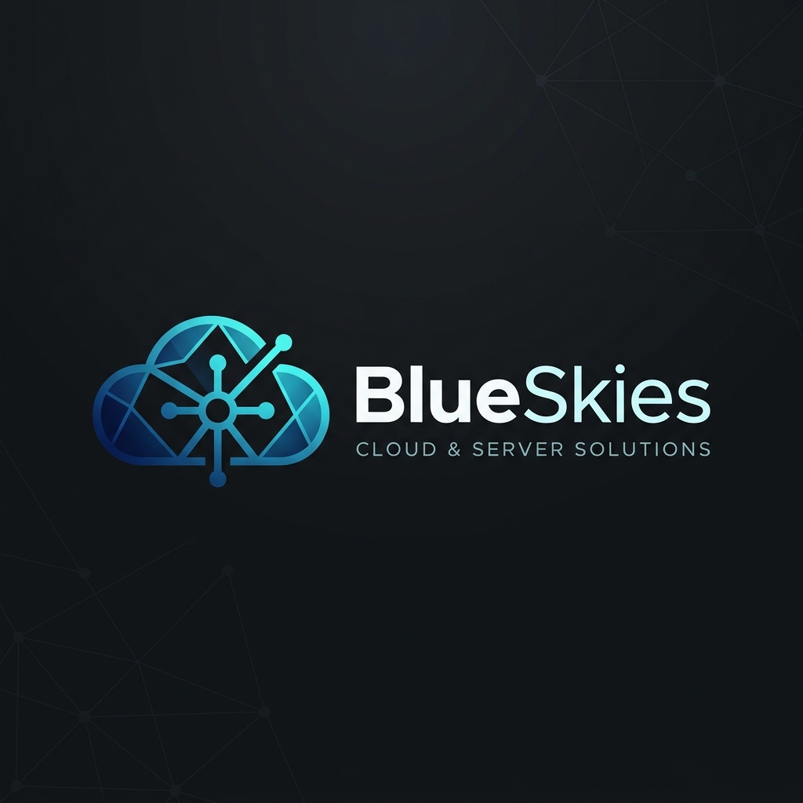
</p>

<p align="center">
  <strong>A zero-cost, enterprise-grade private cloud server and NAS architecture</strong><br/>
  <em>Engineered to permanently bypass commercial cloud storage limits</em> <br>
  <br>
</p>

<p align="center">
  
  
  
  
</p>

---

## 📋 Table of Contents

- [Executive Summary](#-executive-summary)
- [Live Frontend Dashboard](#-live-frontend-dashboard)
- [System Architecture Overview](#-system-architecture-overview)
- [Network Topology](#-network-topology)
- [Data Flow & Automation Pipeline](#-data-flow--automation-pipeline)
- [Component Mind Map](#-component-mind-map)
- [Feature Breakdown](#-feature-breakdown)
- [Security Architecture](#-security-architecture)
- [Tech Stack](#-tech-stack)
- [Directory Structure](#-directory-structure)
- [Deployment Guide](#-deployment-guide)
- [Telemetry Pipeline](#-telemetry-pipeline)
- [Implementation Timeline](#-implementation-timeline)
- [Troubleshooting](#-troubleshooting)

---

## 📖 Executive Summary

**BlueSkies** is a fully operational, zero-cost private cloud storage and home server system designed to solve a real-world problem: the **128GB storage limitation** of an iPhone combined with the **recurring subscription costs** of iCloud, Google Photos, and Dropbox.

Instead of paying for third-party cloud services, this project engineers a complete NAS (Network Attached Storage) architecture from scratch using:
- A **Windows laptop with a 2TB SSD** as the storage host  
- **Tailscale** (WireGuard-based mesh VPN) for worldwide encrypted remote access  
- **Native Windows SMB3** file sharing for zero-latency LAN transfers  
- **Apple iOS Shortcuts** as a free cron-job engine for automated nightly backups  
- A **custom Python telemetry daemon** for real-time hardware monitoring  
- An **automated media management stack** (Radarr + Prowlarr + qBittorrent)  
- A **high-tech scrollytelling frontend** deployed on GitHub Pages with GSAP, Globe.gl, and glassmorphic UI

> **Result:** A fully automated "Safety Net" that backs up original-quality, uncompressed photos every night — without a single rupee spent on software licenses.

---

## 🌐 Live Frontend Dashboard

The project includes a production-deployed, high-performance frontend experience hosted on **GitHub Pages**:

**🔗 [https://saisiddharthbs.github.io/BlueSkies/](https://saisiddharthbs.github.io/BlueSkies/)**

### Frontend Tech Stack

| Technology | Purpose |
|:---|:---|
| **GSAP 3.12 + ScrollTrigger** | Scroll-driven parallax animations, horizontal scroll panels, immersive text reveals |
| **Globe.gl (Three.js)** | Interactive 3D WebGL globe with real-time data node visualization |
| **Vanilla Tilt.js** | 3D parallax tilt effects on glassmorphic pricing cards |
| **Lenis Smooth Scroll** | Butter-smooth scroll normalization across all browsers |
| **Custom Plasma Cursor** | GPU-accelerated trailing cursor with mix-blend-mode exclusion |

### Frontend Sections

| Section | Description |
|:---|:---|
| **Hero** | Cinematic full-screen parallax with animated title reveal |
| **Horizontal Scroll Panels** | GSAP-pinned panels showcasing Performance, Security, and Scalability |
| **Live Telemetry Widget** | Floating glassmorphic HUD with randomized real-time data simulation |
| **Globe.gl Node Map** | Interactive 3D earth with 5 global data center nodes and hover tooltips |
| **Compute Tiers** | 3D-tilting glassmorphic pricing cards (Sigma / Quantum / Zenith) |
| **Immersive Reveal** | Scroll-triggered opacity text animation: "The Future of Connectivity Starts Here" |
| **Magnetic CTA Footer** | Physics-based magnetic button with elastic snap-back |

---

## 🏗️ System Architecture Overview

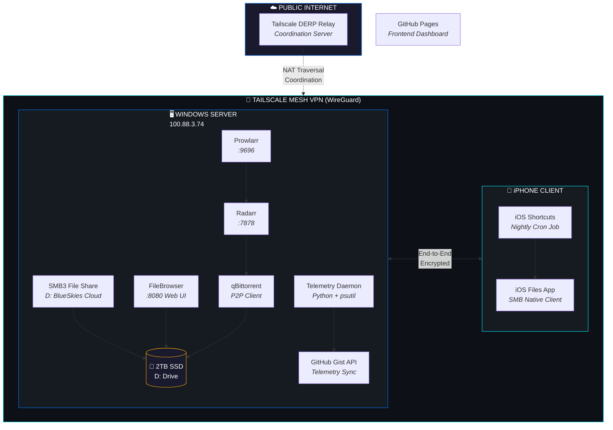

---

## 🌐 Network Topology

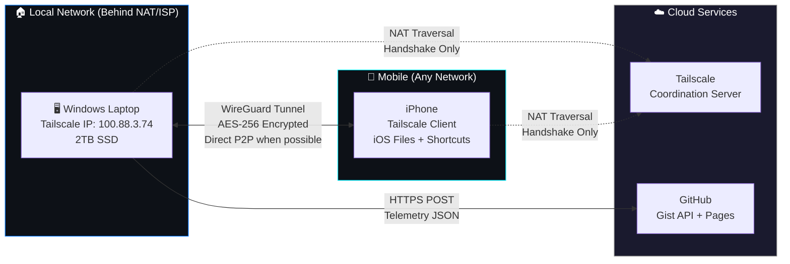

> **Key Insight:** Tailscale only uses the coordination server for the initial NAT traversal handshake. Once the tunnel is established, all data flows **directly peer-to-peer** between the laptop and the iPhone. The coordination server never sees your files.

---

## 🔄 Data Flow & Automation Pipeline

### Nightly Photo Backup Flow

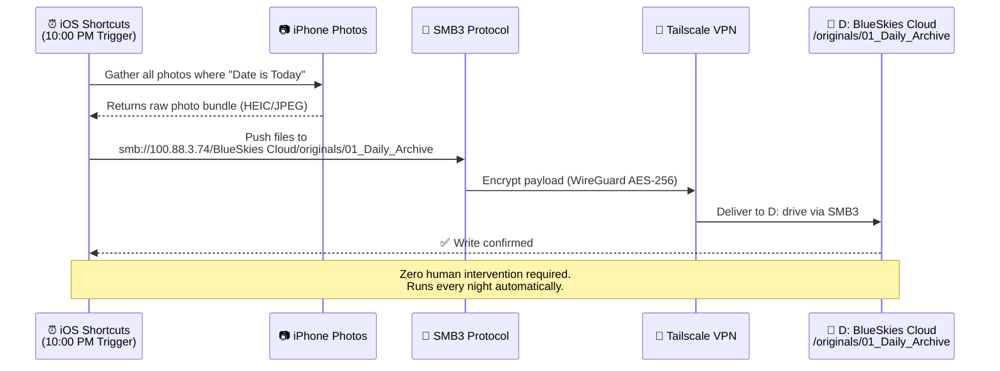

### Media Acquisition Pipeline

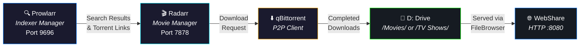

### Telemetry Data Pipeline

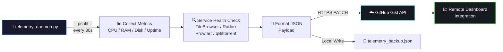

---

## 🧠 Component Mind Map

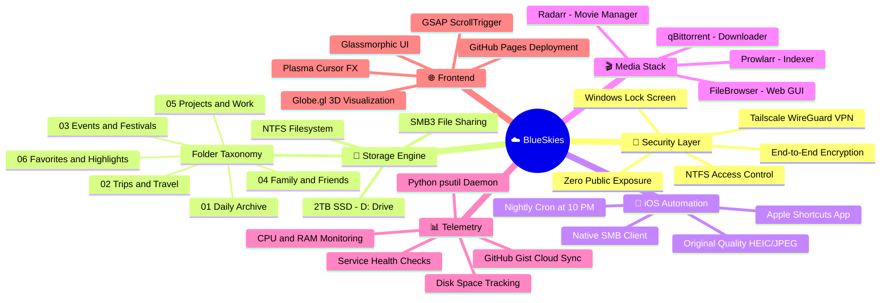

---

## ✨ Feature Breakdown

### 1. 📷 Zero-Cost Original Quality Photo Backup

| Attribute | Detail |
|:---|:---|
| **Trigger** | iOS Shortcuts — Every night at 10:00 PM |
| **Protocol** | SMB3 over encrypted Tailscale tunnel |
| **Quality** | Original, uncompressed (HEIC / JPEG) |
| **Destination** | `D:\BlueSkies Cloud\originals\01_Daily_Archive` |
| **Cost** | **$0.00** — No subscription, no app purchase |

> **Why this matters:** Third-party auto-sync apps like PhotoSync require a paid "Pro" subscription ($4.99) to upload at original quality over SMB. This architecture replaces that entirely with native Apple Shortcuts — for free.

### 2. 🔐 Zero-Trust Mesh VPN (Tailscale)

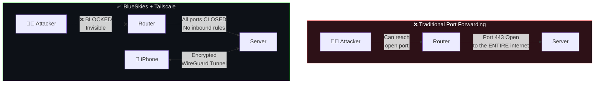

### 3. 🎬 Automated Media Stack (MovieBots)

One-click deployment via Windows Package Manager:
```cmd
.\Install-MovieBots.bat
```
This batch script installs via `winget`:
- **qBittorrent** — P2P download client  
- **Radarr** — Automated movie library management  
- **Prowlarr** — Universal indexer/tracker manager  

### 4. 📊 Hardware Telemetry Daemon

A persistent Python process that collects and pushes live server metrics:

```python
# Metrics collected every 30 seconds
{
    "cpu_temp":  "12.5% LOAD",
    "ram_usage": "6.2 / 16.0 GB",
    "disk_free": "1482.3 GB FREE",
    "uptime":    "72h 14m",
    "services": {
        "filebrowser": true,
        "radarr":      true,
        "prowlarr":    true,
        "qbittorrent": false
    }
}
```

### 5. 🌐 WebShare File Browser

A portable web-based file manager for remote browsing and sharing:
- **Launch:** `.\Start-WebShare-App.bat`
- **Access:** `http://<tailscale-ip>:8080`
- **Features:** Upload, download, share links, user management

### 6. 🧠 AI Rate Limit Monitor (Blueprint)

An architectural blueprint for a **Manifest V3 Chrome Extension** designed to:
- **Passively intercept** ChatGPT web request counts via DOM/XHR monitoring  
- **Micro-ping** developer API keys (Anthropic, OpenAI, Gemini) using a 1-token request costing **$0.000000375** per check  
- Display usage in a **dark glassmorphic dropdown** popup

---

## 🔒 Security Architecture

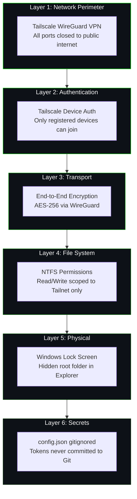

| Threat Vector | Mitigation |
|:---|:---|
| Public internet scanning | Server is invisible — zero open ports |
| Man-in-the-middle attack | WireGuard E2E encryption (AES-256) |
| Unauthorized device access | Tailscale requires authenticated device registration |
| API token leakage | Tokens stored in `config.json` (gitignored), loaded at runtime |
| Physical laptop access | Windows Lock Screen + hidden root folder |
| Telemetry data leakage | JSON contains only system metrics — no PII, no filenames |

---

## 🛠️ Tech Stack

| Layer | Technology | Version / Detail |
|:---|:---|:---|
| **OS** | Windows 10/11 | Storage host with 2TB NTFS SSD |
| **VPN** | Tailscale | WireGuard-based mesh network |
| **File Protocol** | SMB3 | Native Windows file sharing |
| **Client OS** | iOS 17+ | Files App + Shortcuts App |
| **Telemetry** | Python 3.x | `psutil`, `urllib`, `json` |
| **Media - Movies** | Radarr | Port 7878 |
| **Media - Indexer** | Prowlarr | Port 9696 |
| **Media - Downloader** | qBittorrent | Installed via `winget` |
| **Web File Manager** | FileBrowser | Portable `.exe`, Port 8080 |
| **Frontend Framework** | Vanilla JS | No build step |
| **Animation** | GSAP 3.12.5 | ScrollTrigger plugin |
| **3D Globe** | Globe.gl | Three.js wrapper |
| **3D Cards** | Vanilla Tilt 1.8.1 | Glassmorphic parallax |
| **Smooth Scroll** | Lenis 1.0.39 | Studio Freight |
| **Typography** | Google Fonts | Outfit + JetBrains Mono |
| **Hosting** | GitHub Pages | Static deployment from `main` branch |
| **Telemetry Sync** | GitHub Gist API | HTTPS PATCH requests |

---

## 📂 Directory Structure

```
BlueSkies/
│
├── 🌐 FRONTEND (GitHub Pages)
│   ├── index.html              # Main scrollytelling web experience
│   ├── script.js               # GSAP animations, Globe.gl, telemetry simulation
│   ├── style.css               # Glassmorphic design system, plasma cursor
│   └── assets/
│       ├── server_rack.png     # Hero parallax background
│       └── cyber_data.png      # Horizontal scroll panel image
│
├── ⚙️ BACKEND INFRASTRUCTURE
│   ├── telemetry_daemon.py     # Hardware monitoring + GitHub Gist sync
│   ├── Install-MovieBots.bat   # One-click media stack installer (winget)
│   ├── Start-WebShare-App.bat  # FileBrowser web UI launcher
│   └── FileBrowser/            # Portable web-based file manager
│
├── 📝 DOCUMENTATION
│   ├── README.md               # ← You are here
│   ├── BlueSkies_Project_Report.md  # Detailed engineering report
│   └── AI_Monitor_Blueprint.md      # Chrome extension architecture
│
├── 📁 PRIVATE (gitignored)
│   ├── originals/              # Automated iOS photo backups
│   ├── Downloads/              # qBittorrent download target
│   ├── Movies/                 # Radarr movie library
│   ├── TV Shows/               # Television library
│   ├── config.json             # API tokens (never committed)
│   └── telemetry_backup.json   # Local telemetry cache
│
└── .gitignore                  # Protects all private data from Git
```

---

## 🚀 Deployment Guide

### Prerequisites
- Windows 10/11 with a secondary storage drive (D:)
- Python 3.8+ installed
- iPhone with iOS 16+ (for Shortcuts automation)

### Phase 1 — Network Foundation
```
1. Install Tailscale on Windows  →  https://tailscale.com/download
2. Install Tailscale on iPhone   →  App Store
3. Sign in with the same account on both devices
4. Note the Windows machine's Tailscale IP (e.g., 100.88.3.74)
```

### Phase 2 — Storage Configuration
```
1. Create  D:\BlueSkies Cloud\
2. Right-click → Properties → Sharing → Share this folder
3. NTFS Security → Add "Everyone" with Read/Write
4. Create subdirectories under originals/:
   ├── 01_Daily_Archive
   ├── 02_Trips_and_Travel
   ├── 03_Events_and_Festivals
   ├── 04_Family_and_Friends
   ├── 05_Projects_and_Work
   └── 06_Favorites_and_Highlights
```

### Phase 3 — iOS Automation
```
1. Open Shortcuts app on iPhone
2. Create new Automation → Time of Day → 10:00 PM
3. Action 1: Find Photos Where → Date Taken is Today
4. Action 2: Save File → SMB → smb://<tailscale-ip>/BlueSkies Cloud/originals/01_Daily_Archive
5. Enable "Run Without Asking"
```

### Phase 4 — Media Stack
```cmd
.\Install-MovieBots.bat
```

### Phase 5 — Telemetry
```cmd
pip install psutil
python telemetry_daemon.py
```

### Phase 6 — WebShare
```cmd
.\Start-WebShare-App.bat
```

---

## 📊 Telemetry Pipeline

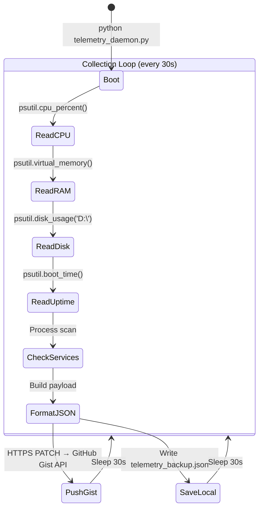

---

## 📅 Implementation Timeline

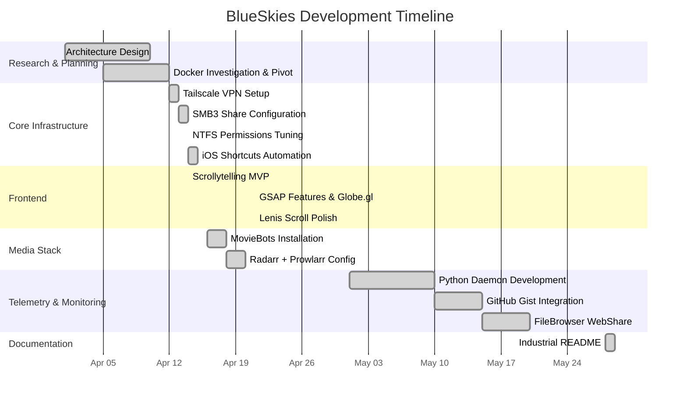

---

## 🔧 Troubleshooting

| Issue | Cause | Fix |
|:---|:---|:---|
| iPhone shows "Content Unavailable" on SMB | NTFS permission mismatch | Grant "Everyone" Read/Write on folder properties |
| Cannot connect via SMB | Tailscale not running on one device | Verify both devices show as "Connected" in Tailscale admin |
| Telemetry daemon crashes | Missing `psutil` module | `pip install psutil` |
| `telemetry_daemon.py` shows "SECURITY HALT" | Token placeholder not replaced | Create `config.json` with your GitHub token |
| FileBrowser blocked by Windows Defender | Firewall rule not set | Click "Allow Access" when prompted, or add manual rule |
| GitHub push rejected (secret scanning) | Token committed to Git | Ensure `config.json` is in `.gitignore` — never hardcode tokens |

---

## 📄 License

This project is licensed under the **MIT License** — see the [LICENSE](LICENSE) file for details.

---

<p align="center">
  <strong>Engineered & Maintained by Sai Siddharth B S</strong><br/>
  <em>BlueSkies — Because your data belongs to you.</em>
</p>
